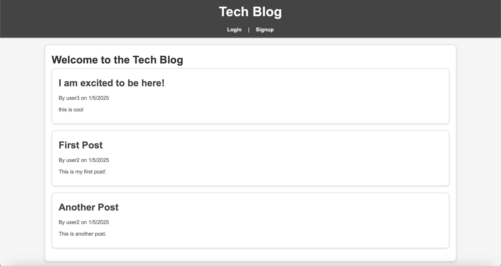

# MVC-Tech-Blog

## Table of Contents
1. [Overview](#overview)
2. [Demo](#demo)
3. [Concepts Covered](#concepts-covered)
4. [Learning Objectives](#learning-objectives)
5. [Technologies Used](#technologies-used)
6. [Summary](#summary)
7. [Features](#features)
8. [Setup and Installation](#setup-and-installation)
   - [Prerequisites](#prerequisites)
   - [Steps to Run Locally](#steps-to-run-locally)
   - [Deploying to Render](#deploying-to-render)
   
## Overview

This project is a CMS-style blog site built from scratch using the **Model-View-Controller (MVC)** architecture. The application allows developers to create and manage blog posts, as well as comment on other developers' posts. The app utilizes **Sequelize** as the ORM, **Handlebars.js** for templating, and **express-session** for authentication. The blog is deployed on **Render**, making it accessible online.

The app includes a user authentication system where users can sign up, log in, create blog posts, and interact with other posts by commenting. The functionality is divided across three main components: **Models** (Sequelize ORM), **Views** (Handlebars templates), and **Controllers** (Express routes).

The main goal of the project is to implement a dynamic CMS that allows users to share their thoughts, opinions, and technical insights in a blog-style format, similar to platforms like WordPress.

## Demo



[Site Link](https://mvc-tech-blog-bzaw.onrender.com)

## Concepts Covered

- **MVC Architecture**: This project follows the MVC architecture where:
  - **Model**: Represents the data structure, including user, post, and comment models managed by Sequelize.
  - **View**: Handlebars.js is used for rendering the UI, ensuring separation of logic and presentation.
  - **Controller**: Handles the logic for user actions (e.g., creating, reading, updating, and deleting posts) via Express.js.

- **User Authentication**: Implemented using **express-session** for managing user login and session persistence.

- **Database Integration**: Utilizes **PostgreSQL** via Sequelize ORM to manage blog data, including user credentials, posts, and comments.

- **Dynamic Content**: The site allows users to interact with the content by creating, updating, deleting posts, and adding comments.

- **Deployment**: The app is deployed on **Render**, a cloud platform, with automatic database syncing and seeding during deployment.

## Learning Objectives

By completing this project, you will:

- Gain hands-on experience with the **MVC design pattern** in full-stack web development.
- Understand how to use **Sequelize ORM** with **PostgreSQL** for data management in a web application.
- Learn how to build dynamic web pages using **Handlebars.js**.
- Implement **user authentication** using **express-session** for secure user management.
- Learn how to **deploy** a full-stack application to a cloud provider (**Render**).
- Learn how to set up **environment variables** and handle secure database connections.

## Technologies Used

- **Node.js**: JavaScript runtime environment for building the server.
- **Express.js**: Web framework for building the API and handling routes.
- **Sequelize**: ORM for interacting with the PostgreSQL database.
- **PostgreSQL**: Relational database used for storing blog data.
- **Handlebars.js**: Templating engine for rendering HTML views.
- **express-session**: Middleware for session management and authentication.
- **Render**: Cloud platform for deploying the app with automatic database configuration.
- **dotenv**: Module for managing environment variables (e.g., database credentials).

## Summary

This CMS-style blog site allows developers to sign up, log in, and create posts about their technical insights, thoughts, and opinions. It also enables commenting on others' posts, fostering interaction among users. The application is built with the MVC architecture, ensuring that the data management, presentation, and logic are separated for easier maintenance and scalability.

By using **Sequelize** for interacting with a **PostgreSQL** database, the application provides a secure and efficient way to store and retrieve data. **Handlebars.js** ensures that the user interface remains dynamic and maintains a clean separation of concerns.

The site is deployed on **Render**, a cloud platform that handles the backend and database integration seamlessly. This project demonstrates the power of combining **Node.js**, **Express**, **Sequelize**, **Handlebars.js**, and **Render** to create a fully functional web application.

## Features

- **User Authentication**: Users can sign up, log in, and manage their sessions.
- **Create and Manage Blog Posts**: Authenticated users can create, edit, and delete posts.
- **Comment on Posts**: Users can leave comments on posts and interact with other developers.
- **Dashboard**: Displays all posts created by the authenticated user and allows editing or deleting posts.
- **Responsive Design**: The app is designed to be mobile-friendly with a clean user interface.

## Setup and Installation

### Prerequisites

- Node.js (v14 or later)
- PostgreSQL
- npm (Node package manager)

### Steps to Run Locally

1. Install the dependencies:

   ```bash
   npm install
   ```

2. Create a `.env` file in the root of the project and add the following:

   ```plaintext
   DB_USER=your_db_user
   DB_PASSWORD=your_db_password
   DB_NAME=your_db_name
   DATABASE_URL=your_postgresql_database_url
   ```

3. Sync and seed the database locally (if desired):

   ```bash
   npm run seed
   ```

4. Start the server:

   ```bash
   npm start
   ```

5. Navigate to `http://localhost:3001` to see the application in action.

### Deploying to Render

1. Sign up on [Render](https://render.com) and create a new web service.
2. Connect your GitHub repository and set the build command as `npm install`.
3. Set the start command as `npm start`.
4. Add your environment variables (`DATABASE_URL`) on Render's dashboard.
5. Deploy the app to Render.

## Summary

This project demonstrates a complete workflow for building and deploying a CMS-style blog site, following the MVC architecture. The app allows developers to publish and manage blog posts, comment on other posts, and manage user authentication. Using tools like **Sequelize**, **Handlebars.js**, and **express-session**, the app offers a robust, scalable solution that can be easily extended with more features in the future.
